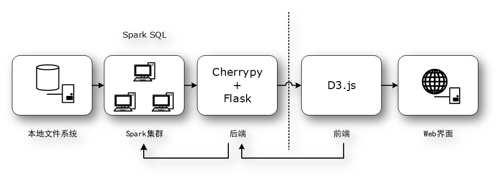
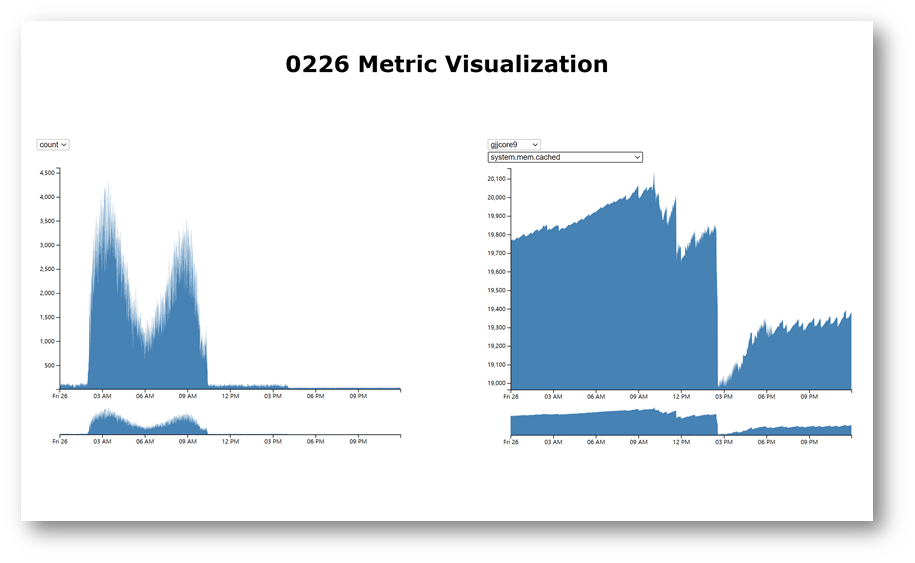
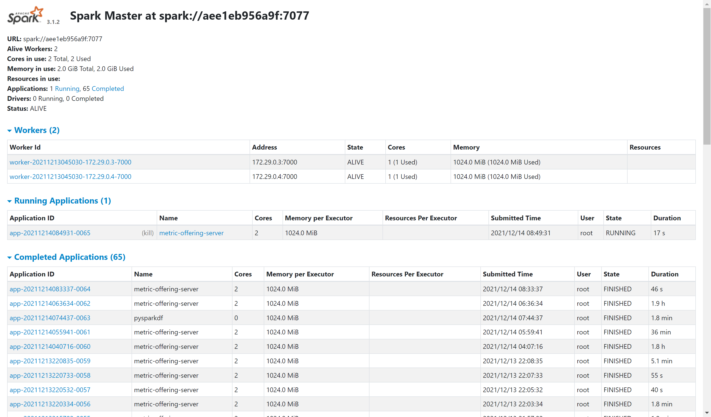

## 依赖环境

```
docker
docker-compose
```

## 整体流程



## Spark集群

1. `docker-compose`设置：

```yaml
images:
可以从dockerhub直接拉取，不需要提前pull
ports:
-8080: Spark Web UI端口
-7077: Spark集群内部访问端口，暴露在master上
-5432: 前端展示端口
volumes:
数据挂载点，需要根据自己的路径挂载
```

2. 根据`docker-compose.yml`进行环境搭建，其中包含1个`spark-master`和2个`spark-worker`：

```bash
docker-compose up -d
```

3. **进入master节点容器**，安装依赖环境：

```bash
cd /workspace-1/CloudCompute/cc-workspace/first-application
pip3 install -r requirements.txt
```

​	  注意，上述的两行命令是在`spark-master`的容器中运行的。

## 后端

### 预处理

预处理`metric_0226.csv`得到微服务和`KPI`的聚类结果，保存在`cmdb-kpi.json`中。预处理结果是由`cluster_cmdb_kpi.py`得到的，要运行该代码，只需要输入以下命令：

```bash
/path/to/spark-submit --master "local[2]" cluster_cmdb_kpi.py
```

由于跑起来很简单，就直接在本机跑了。

### 服务器端

主代码包含`server.py, engine.py, app.py`。

主代码中有几处需要根据自身情况修改：

```python
server.py:
 8: conf = SparkConf().setAppName("metric-offering-server") # 可修改AppName
40: dataset_path = os.path.join('/', 'workspace-1', 'CloudCompute', 'cc-workspace', 'data', '0226', 'metric') # 可修改为数据集在master容器中的文件夹位置

engine.py:
14: kpi_path = os.path.join(data_path, 'kpi_0226.csv') # 可修改为其他数据文件
17: metric_path = os.path.join(data_path, 'metric_0226.csv') # 可修改为其他数据文件
```

根据自身情况修改完后，**进入master节点容器**，运行以下命令：

```bash
/opt/spark/bin/spark-submit --master "spark://spark-master:7077" server.py
```

## 前端

前端代码在`observablehq`上测试完成并发布，在`index.html`中远程拉取并运行。

可通过如下链接进行访问：[CloudComputeFinal](https://observablehq.com/@jxrjxrjxr/cloudcomputefinal)。（用户`jxrjxrjxr`系本人）

p.s. 前后端数据传输的代码编写耗时颇多，所幸最后没有bug了。

## Web 界面

等待一段时间即可在浏览器中通过`http://ip:15432`访问前端界面：



通过`http://ip:19090`访问`Spark Web UI`以查看`Job`分配以及各节点工作情况：

